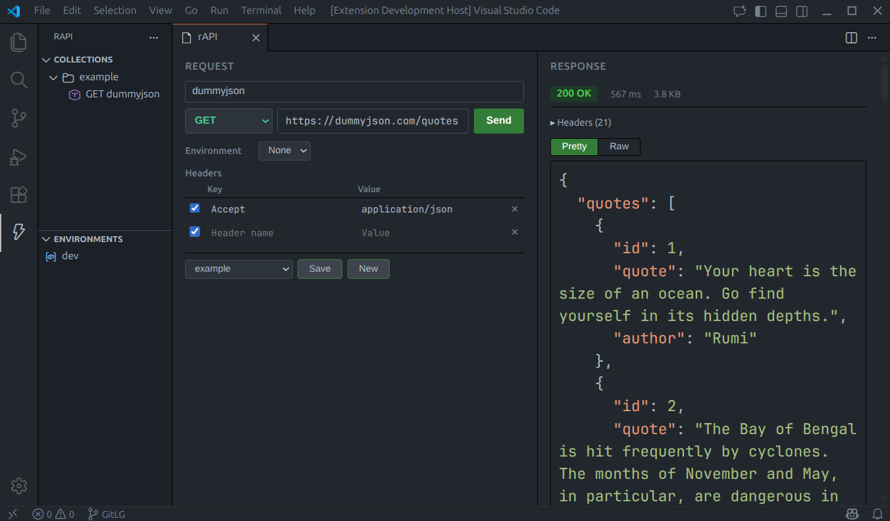

# rAPI

**A simple and intuitive REST client VS Code extension for people who hate SaaS-ification of dev tools.**

No login. No cloud. No telemetry.\
Just send HTTP requests and save them as plain JSON files inside your workspace.

<br>

> ⚠️ **Early Stage Project**\
rAPI is still in active development. Some features are incomplete and others are planned but not yet implemented. I work on this alongside academics and life, so progress may be slow — but contributions, suggestions, and pull requests are always welcome! 😀

---
## Why this extension?

There are already many excellent API tools out there. rAPI exists because I wanted something that better fit my personal workflow:

- I wanted to test APIs directly inside VS Code without switching to another app
- Some tools require login or cloud sync, which I prefer to avoid
- Some UI-heavy tools felt cluttered for quick testing
- Text-based solutions using .http files are powerful, but I wanted a more visual and interactive interface

So I decided to build a tool to fill in the gap for my personal pain points, something that is:

✅ Local-first\
✅ Minimal and distraction-free\
✅ Simple to use\
✅ Free and open

No accounts. No platforms. Just requests and responses.

## Preview



## Features

- **Send HTTP requests** — GET, POST, PUT, PATCH, DELETE, OPTIONS
- **Request editor** — method selector with color-coded verbs, URL, key-value headers table, raw JSON body
- **Response viewer** — status, timing, collapsible headers, syntax-highlighted JSON & HTML, raw view
- **Theme-aware syntax highlighting** — response body colors match your active VS Code theme, updates instantly on theme change
- **Resizable split pane** — drag the divider between request editor and response viewer
- **Collections** — save/load requests as `.rapi/collections/*.json` in your workspace
- **Environments** — define variables in `.rapi/environments/*.json`, use `{{var}}` placeholders
- **Sidebar tree view** — browse collections and click to open requests
- **Keyboard shortcut** — `Ctrl/Cmd+Enter` to send
- **Local-first** — everything stored as plain JSON files, version-control friendly

## Getting Started

### Run in Development Mode

```bash
# Clone and open in VS Code
cd rapi-extension
npm install
npm run build     # or: npm run watch

# Press F5 in VS Code → "Run Extension"
# This opens a new Extension Development Host window
```

### Usage

1. Open the command palette (`Ctrl/Cmd+Shift+P`) and run **`rAPI: Open rAPI`**
2. The rAPI panel opens with a request editor (left) and response viewer (right)
3. Enter a URL (e.g. `https://httpbin.org/get`) and click **Send**
4. Save requests to collections using the **Save** button
5. Browse saved requests in the **rAPI** sidebar

### Creating Collections

- Command palette → **`rAPI: Create Collection`**
- Or save a request from the editor — choose a collection name from the dropdown

### Using Environments

Create a JSON file in `.rapi/environments/`, e.g. `.rapi/environments/dev.json`:

```json
{
  "name": "dev",
  "values": {
    "baseUrl": "https://httpbin.org",
    "token": "my-secret-token"
  }
}
```

Then in your requests, use `{{baseUrl}}` or `{{token}}` — they'll be replaced before sending.

Select the active environment from the dropdown in the request editor.

## File Structure

```
.rapi/
├── collections/
│   └── example.json      # saved request collections
└── environments/
    └── dev.json           # environment variable sets
```

### Collection file format

```json
{
  "name": "example",
  "requests": [
    {
      "id": "unique-id",
      "name": "Get httpbin",
      "method": "GET",
      "url": "{{baseUrl}}/get",
      "headers": { "Accept": "application/json" },
      "body": null
    }
  ]
}
```

### Environment file format

```json
{
  "name": "dev",
  "values": {
    "baseUrl": "https://httpbin.org",
    "token": "REPLACE_ME"
  }
}
```

## Security Notes

> **Warning:** Environment files are stored as plain JSON in your workspace.
> Do **not** commit secrets (API keys, tokens) to version control.
> Add `.rapi/environments/` to your `.gitignore` if your environments contain sensitive values.

Example `.gitignore` entry:

```
# Keep collections but ignore environments with secrets
.rapi/environments/
```
I might implement other ways to handle this sometime in the future but for now, this is as is.

## Tech Stack

- **Extension host:** TypeScript, VS Code Extension API
- **Webview UI:** React 18
- **HTTP client:** Node.js built-in `http`/`https` (runs in extension host — no CORS issues)
- **Bundler:** esbuild
- **Persistence:** Plain JSON files via `vscode.workspace.fs`

## Commands

| Command                  | Description                        |
| ------------------------ | ---------------------------------- |
| `rAPI: Open rAPI`        | Open the rAPI request editor panel |
| `rAPI: Create Collection`| Create a new empty collection file |

## Keyboard Shortcuts

| Shortcut          | Action       |
| ----------------- | ------------ |
| `Ctrl/Cmd+Enter`  | Send request |

## Non-Goals (by design)

- No OAuth flows or account-based sync
- No scripting or test runner
- No GraphQL or WebSocket support
- No analytics or crash reporting
- No cloud anything

## License

MIT
